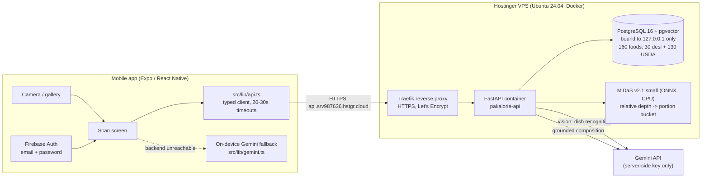

# Pakalorie — System Design Specification (P1 Final)

Source material for the SDS/report chapters. Every claim here is either
verified against the live system or explicitly marked pending. Companion map
of who pastes what: [`TEAM_GUIDE.md`](./TEAM_GUIDE.md) §4.

Last updated: 2026-06-10.

---

## 1. System architecture

> Editable Excalidraw diagrams (with rendered PNGs) for every section live in
> [`diagrams/`](./diagrams/): system architecture, scan pipeline, RAG engine,
> ML pipelines, DB schema, and mobile navigation. Open the `.excalidraw` files
> at excalidraw.com to edit; drop the PNGs straight into the report.

Request flow for one scan: photo → `POST /recognize` (server-side Gemini
Vision → dish label + confidence + alternatives) → `POST /portion` (MiDaS
depth → portion bucket, optional) → `POST /calories` (retrieve nutrition rows
from Postgres → Gemini composes a breakdown constrained to those rows) →
results screen shows macros, a DB-grounded provenance pill, and a "How we got
this" card with the matched row, the engine's why, and the data source.

## 2. Module breakdown (the four graded P1 Final modules)

### 2.1 Food Database API — LIVE

- FastAPI + SQLAlchemy 2.0 (async) + Alembic on the VPS, behind Traefik HTTPS
  at `https://api.srv987636.hstgr.cloud`. Container publishes no host port.
- Schema (5 tables): `foods`, `food_aliases`, `nutrition_facts` (fiber
  nullable — desi rows have none and the UI shows a dash instead of inventing
  one), `portion_sizes` (labeled rows, not a fixed enum), `modifier_constants`
  (additive kcal deltas, e.g. `extra_tarri: +60`).
- Seed: 160 rows — 30 curated Pakistani dishes (`desi_v1`, with Urdu +
  Roman-Urdu aliases) + 130 USDA Foundation Foods (`usda`). Idempotent seeder.
- Search: Postgres `pg_trgm` trigram similarity over names + aliases (handles
  "nihari", "نہاری", typos). Shared threshold with the RAG retrieval layer.
- Full endpoint contract: [`../backend/docs/API_CONTRACT.md`](../backend/docs/API_CONTRACT.md);
  interactive OpenAPI at `/docs` on the live host.

### 2.2 Calorie Calculation Engine + RAG — LIVE (showpiece)

Methodology in §3; evaluation in §5.1.

### 2.3 YOLOv8 Food Classification — trained baseline complete

- Dataset: two Kaggle sets audited and merged — 218 normalized classes, 8,660
  images, SHA-1 exact dedupe, stratified 80/20 split, 14.58x class imbalance
  (audit: [`../ml/reports/dataset_audit.md`](../ml/reports/dataset_audit.md)).
- Decision (2026-06-10): train the **full 218-class honest baseline** first
  (`yolov8n-cls`, 224px, 50 epochs, free Colab T4); escalate to `yolov8s-cls`
  if weak — never silently prune awkward classes.
- Result (2026-06-28): trained on 217 classes (one ultra-rare 1-image class
  dropped in the stratified split). **Top-1 0.5848, Top-5 0.8659.** Strong on
  well-sampled dishes (biryani 0.93, chai/samosa 1.00); the top-1 gap is the
  under-sampled long tail, consistent with the 14.58x imbalance — exactly the
  predicted failure mode, not a modeling fault. `best.pt` (3.5 MB) + `best.onnx`
  (6.6 MB) + confusion matrix + per-class recall committed under
  [`../ml/artifacts/checkpoints/`](../ml/artifacts/checkpoints/) and
  [`../ml/reports/`](../ml/reports/).
- One self-contained notebook produces all artifacts:
  [`../ml/notebooks/train_yolov8_cls.ipynb`](../ml/notebooks/train_yolov8_cls.ipynb)
  (walkthrough: [`TEAM_GUIDE.md`](./TEAM_GUIDE.md) §2). Metrics land in
  [`../ml/MODELCARD.md`](../ml/MODELCARD.md).
- Scope note for the report: classification, not detection — the datasets are
  folder-per-dish with no bounding boxes (decision logged 2026-06-03). The
  live `/recognize` path stays Gemini Vision for P1 Final; the trained model
  is the reported deliverable and the P2 on-device path.

### 2.4 Volume & Depth Estimation (MiDaS) — LIVE

- `POST /portion`: pretrained MiDaS v2.1 small (ONNX, CPU-only, 256x256) on
  the VPS produces a **relative** inverse-depth map; a documented heuristic
  (mound prominence + near-band fill) maps it to a `small`/`medium`/`large`
  bucket with multipliers 0.75 / 1.0 / 1.3.
- The calorie engine consumes the bucket (`portion`) and/or the multiplier
  (`portion_multiplier`, applied deterministically AFTER LLM grounding so the
  arithmetic is exact and source rows stay unscaled).
- Deliberately minimal and honest: no grams are claimed — monocular depth from
  one uncalibrated photo has no absolute scale. Full methodology +
  limitations (report this verbatim):
  [`../backend/docs/DEPTH_NOTES.md`](../backend/docs/DEPTH_NOTES.md).
- Verified live on the deployed VPS (`POST /portion`) with the real test photo
  (Haleem): `medium` bucket, prominence 0.24, near-fill 21%, score 0.22 — the
  endpoint runs real ONNX inference in production, not just locally. Tests cover
  the heuristics, the 503 setup path, multiplier math, and ONNX inference.

## 3. RAG methodology (calorie engine)

1. **Retrieve.** The recognized dish name is matched against the food DB with
   `pg_trgm` trigram similarity over names and aliases (top-k, default 3).
   Each retrieved row carries its labeled portions, macros, and modifier
   constants. (pgvector is enabled in the DB for a future embedding upgrade;
   trigram retrieval proved sufficient at this catalog size.)
2. **Compute.** The engine deterministically selects the portion (exact label
   match, else the small/medium/large bucket maps to the
   smallest/middle/largest labeled row, else the default portion) and applies
   only modifiers that exist on that food:
   `final_kcal = portion_kcal + Σ modifier_kcal`.
3. **Generate, grounded.** Gemini receives ONLY the retrieved source rows plus
   the precomputed calculation and must compose the JSON answer constrained to
   those facts ("Use ONLY the retrieved source rows. Do not invent nutrition
   numbers."), returning a one-sentence `why`. Temperature 0.1, native JSON
   output, thinking budget 0 (a real bug we found: thinking tokens were
   truncating JSON output; fixed in `app/services/gemini.py`).
4. **Fail safe.** Without a Gemini key (or on model failure) a deterministic
   local fallback produces the same grounded numbers (`model_used:
   local_grounded_fallback`). The response always carries `source_rows`, so
   the client can show provenance and the claim "grounded" is auditable.
5. **Scale.** An optional portion multiplier from the MiDaS bucket is applied
   after grounding (§2.4).

## 4. API surface (live)

| Endpoint | Purpose |
|---|---|
| `GET /healthz` | liveness |
| `POST /recognize` | image → dish label + confidence + alternatives (server-side Gemini Vision) |
| `GET /foods/search?q=` | fuzzy EN/Urdu/Roman-Urdu food search |
| `GET /foods/{id}` | full detail: aliases, labeled portions, modifiers |
| `POST /foods/{id}/nutrition` | portion + modifier math, 422 on foreign portion/modifier |
| `POST /calories` | RAG-grounded calorie/macro breakdown + why + source rows |
| `POST /portion` | MiDaS depth → portion bucket + multiplier (after next deploy) |

All non-health endpoints use the `{success, data, error}` envelope. Request/
response examples: [`../backend/docs/API_CONTRACT.md`](../backend/docs/API_CONTRACT.md).

## 5. Results

### 5.1 Calorie engine evaluation — VERIFIED on the live API (2026-06-10)

12 known-dish cases (multi-portion dishes, additive and negative modifiers,
fuzzy queries) against the production endpoint with the real Gemini-grounded
path: **12/12 exact matches, MAE = 0.0 kcal, max |delta| = 0 kcal.**

Full table + what the eval does and does not measure:
[`../backend/docs/CALORIE_EVAL.md`](../backend/docs/CALORIE_EVAL.md).
Reproduce with `node scripts/calorie-eval.mjs`.

### 5.2 Recognition (live Gemini path) — qualitative verification

Real photo test (2026-06-04): `test_food.webp` → **Haleem @ 0.98
confidence**, with sensible look-alike alternatives (Dal Gosht, Hareesa,
Khichra). Non-food images correctly return "Unknown". API contract smoke:
10/10 (`node scripts/api-smoke.mjs`).

### 5.3 YOLOv8 — PENDING the Colab run

Table lands in [`../ml/MODELCARD.md`](../ml/MODELCARD.md) (top-1/top-5,
confusion matrix, per-class worst-15 error analysis, qualitative predictions
on our own photos). The notebook auto-generates the block.

### 5.4 MiDaS — by design, no accuracy number

There is no labeled portion dataset to score the bucket against, and we do not
invent one. Reported instead: methodology, a real sample output (§2.4), and
the limitations write-up ([`DEPTH_NOTES.md`](../backend/docs/DEPTH_NOTES.md)).
A wrong bucket bounds calorie error to roughly ±30% by construction of the
multipliers.

## 6. Security & deployment posture

- HTTPS only, via the existing Traefik with Let's Encrypt; security headers
  (HSTS, nosniff, XSS filter) set as router middleware.
- Postgres bound to `127.0.0.1` inside the VPS — externally unreachable
  (verified: public port probe fails).
- Gemini API key lives only in the server's on-box `.env`; the mobile bundle
  contains no key for the primary path. (The on-device fallback key is a
  documented Expo-Go-demo exception, removed in P2.)
- API container: no published host port, memory/CPU/PID limits, healthcheck,
  `alembic upgrade head` on boot (idempotent).
- Runbooks: deploy [`../backend/docs/DEPLOY.md`](../backend/docs/DEPLOY.md),
  local DB smoke [`../backend/docs/LOCAL_DB_SMOKE.md`](../backend/docs/LOCAL_DB_SMOKE.md).

## 7. Known gaps (honest list, also for the viva)

1. YOLOv8 training run not yet executed (notebook + dataset ready; ~90 min on
   a free T4 — see TEAM_GUIDE §2).
2. MiDaS `/portion` is merged but not yet redeployed to the VPS (DEPLOY.md
   §4b is the one-command step); not wired into the mobile scan flow yet.
3. On-device end-to-end smoke test of the scan flow pending (Expo Go,
   `npx expo start -c --max-workers 2`).
4. Save-to-history still writes to the legacy Supabase table (Firestore
   migration is logged as CDX-001, P2 cleanup).
5. Google OAuth is code-wired but requires a dev build; the demo uses
   email/password by design.
